# 🎓 Proyecto_Titulo — Manual de Usuario (operación con flujo y botones)

Sistema de **Biblioteca Escolar CRA**. Este manual cubre **todo el sistema** con “lo justo y necesario” y explicando el **flujo real con botones** para cada acción.

---

## 0) Acceso y conceptos clave

- **URL:** definida por el colegio (p. ej., `https://tu-dominio.cl`).
- **Sesión:** inicia con tu **correo** y **contraseña** (botón **Iniciar sesión**).
- **Roles:** `admin`, `profesor`, `personal`, `alumno`, `visitante`.
- **Catálogo público:** visible sin sesión (no permite acciones).
- **Flujo central:** **Reserva → Confirmación → Préstamo → (Renovación) → Devolución**.
- **Vencimientos:** Libro **10 días hábiles**; Recurso CRA **uso del día** (según política).
- **Reserva:** expira a **2 días hábiles** si no se confirma.
- **Sanción:** bloquea nuevas reservas/préstamos hasta la fecha indicada.

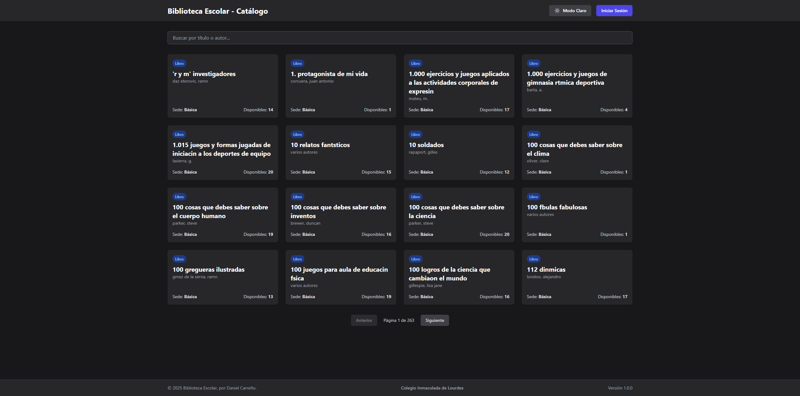  
*Vista pública sin iniciar sesión.*

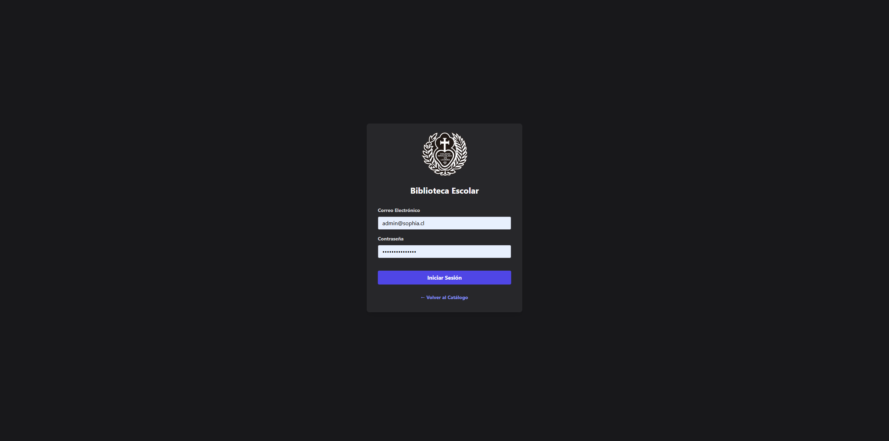
*Vista iniciar sesión.*

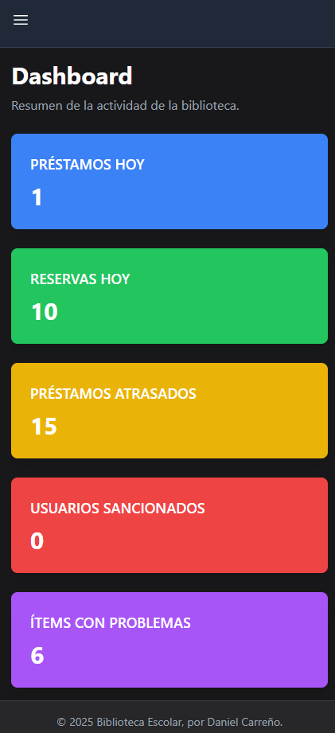  
*Menú lateral en dispositivos móviles.*

---

## 1) Rol: Administrador

Al entrar como **Admin** verás el **Dashboard** con tarjetas: **Préstamos del día**, **Reservas activas**, **Préstamos atrasados**, **Usuarios sancionados** e **Ítems en atención**. Desde cada tarjeta puedes **hacer click** para ir a la sección relacionada.

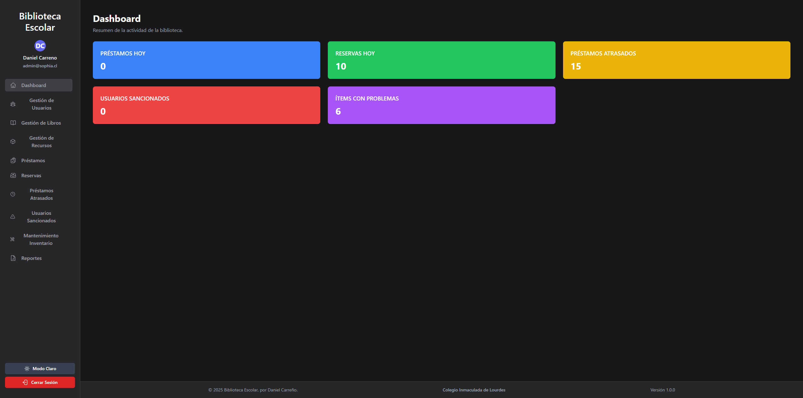  
*Panel con métricas y accesos rápidos.*

### 1.1 Usuarios

**Ruta:** *Admin → Usuarios*  
**Para:** alta/baja/edición de usuarios y asignar **roles**.  
> **Nota:** **Perdonar sanción** NO se hace aquí; está en *Admin → Usuarios Sancionados*.

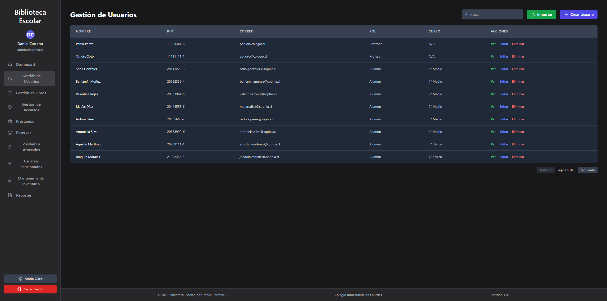  
*Gestión de cuentas y roles.*

**Crear/Editar usuario**

1. Pulsa **Crear Usuario** (abre modal **UserForm**).
2. Completa campos:
   - **Obligatorios:** `primerNombre`, `primerApellido`, `rut` (**único**), `correo` (**único**), `rol`.
   - **Condicional:** `curso` (**solo si** `rol = alumno` → **obligatorio**).
   - **Opcionales:** `segundoNombre`, `segundoApellido`, `password` (si lo dejas vacío, se usa **RUT** como contraseña inicial).
3. Toca **Guardar** (o **Cancelar** para cerrar sin cambios).

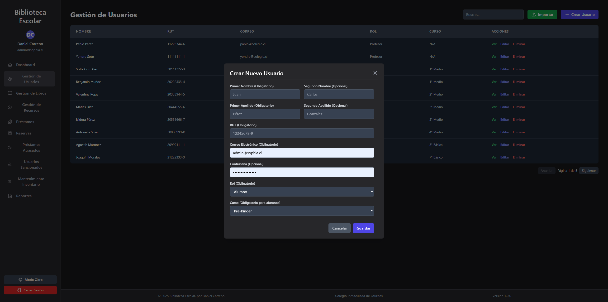  
*Formulario de alta con validaciones.*
*Campo `curso` obligatorio cuando el rol es Alumno.*

**Editar / Eliminar**

- **Editar:** en la fila del usuario, pulsa **Editar** → actualiza → **Guardar**.  
- **Eliminar:** en la fila, pulsa **Eliminar** → confirma **Sí, eliminar**.  
  - El sistema **impide** eliminar si el usuario tiene **préstamos en curso/atraso**.  
  - Si tiene **reservas pendientes**, al eliminarlo esas reservas se **liberan**.

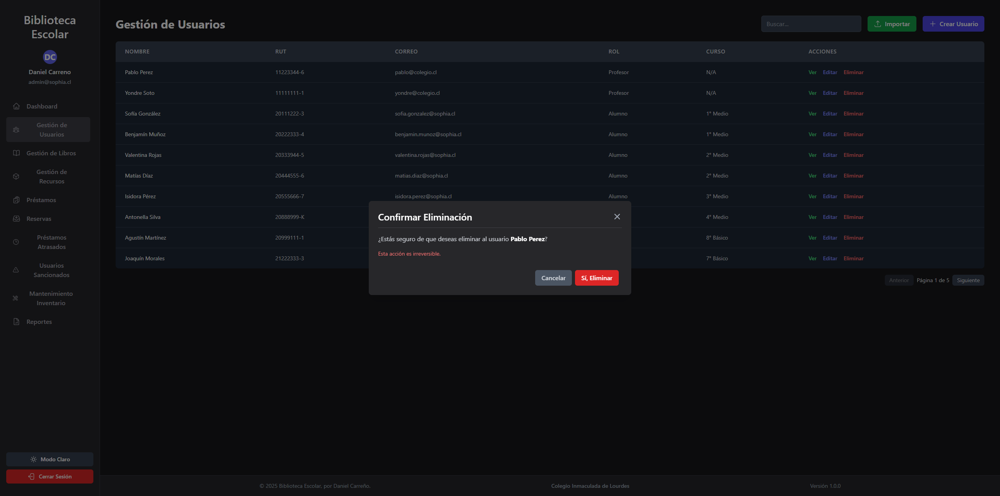  
*Confirmación segura; no permite eliminar con préstamos activos/atraso.*

---

### 1.2 Usuarios Sancionados

**Ruta:** *Admin → Usuarios Sancionados*  
**Para:** ver sanciones **vigentes** y **perdonarlas**.

**Flujo**

1. Ubica al usuario sancionado.  
2. Pulsa **Perdonar sanción** (se abre modal).  
3. Confirma con **Sí, perdonar** → el sistema quita la sanción y la lista se actualiza.  
4. Si no deseas continuar, pulsa **Cancelar** en el modal.

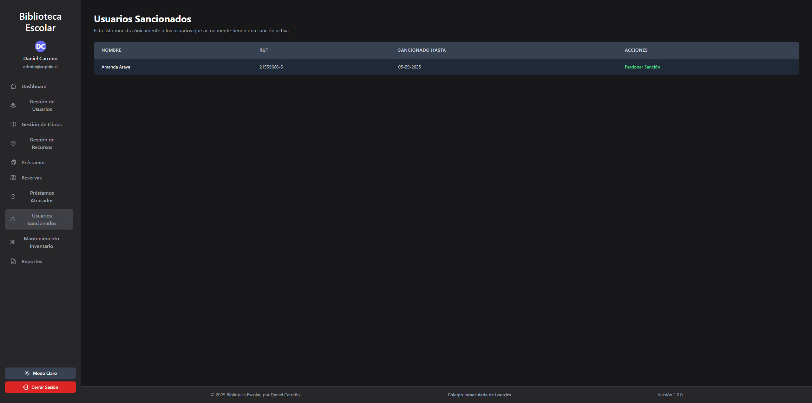  
*Vista dedicada a sanciones vigentes.*

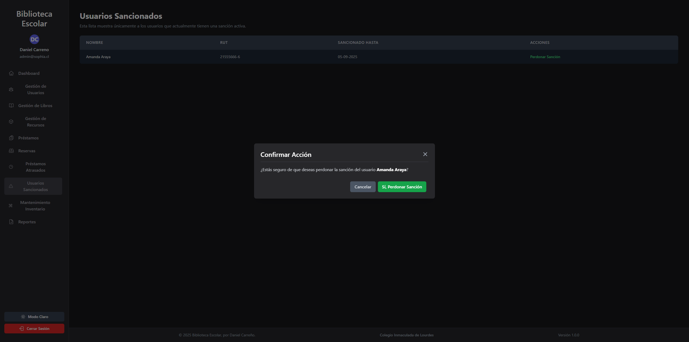  
*Único lugar del frontend para levantar sanciones.*

---

### 1.3 Libros y Ejemplares

**Ruta:** *Admin → Libros*  
**Para:** crear/editar **Libro** (base) y administrar sus **Ejemplares** (copias).

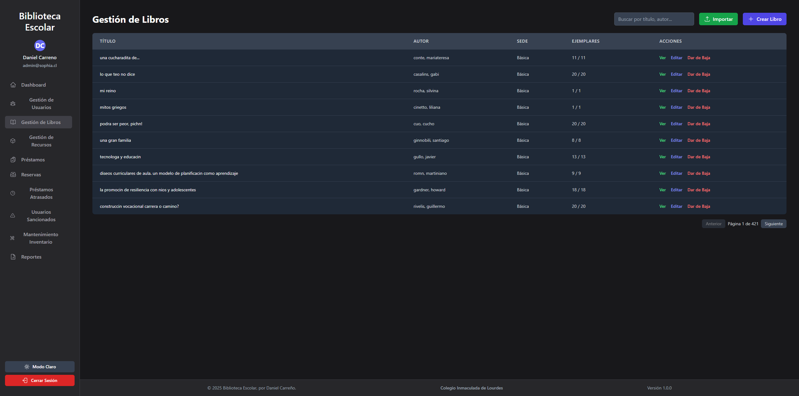  
*Catálogo de libros con acciones.*

**Crear libro**

1. Pulsa **Crear Libro** (abre modal **BookForm**).  
2. Completa campos:
   - **Obligatorios (form):** `titulo`, `autor`, `lugarPublicacion`, `editorial`, `añoPublicacion`, `sede`.  
   - **Obligatorio (modelo):** `tipoDocumento` (preconfigurado como “Libro”).  
   - **Opcionales:** `isbn` (único *sparse*), `pais` (default “Chile”), `numeroPaginas`, `idioma`, `cdd`, `edicion`, `descriptores` (separados por comas), `ubicacionEstanteria`.  
   - **Ejemplares iniciales:** `cantidadEjemplares` (si lo dejas vacío, **1**).
3. Pulsa **Guardar** (o **Cancelar**).

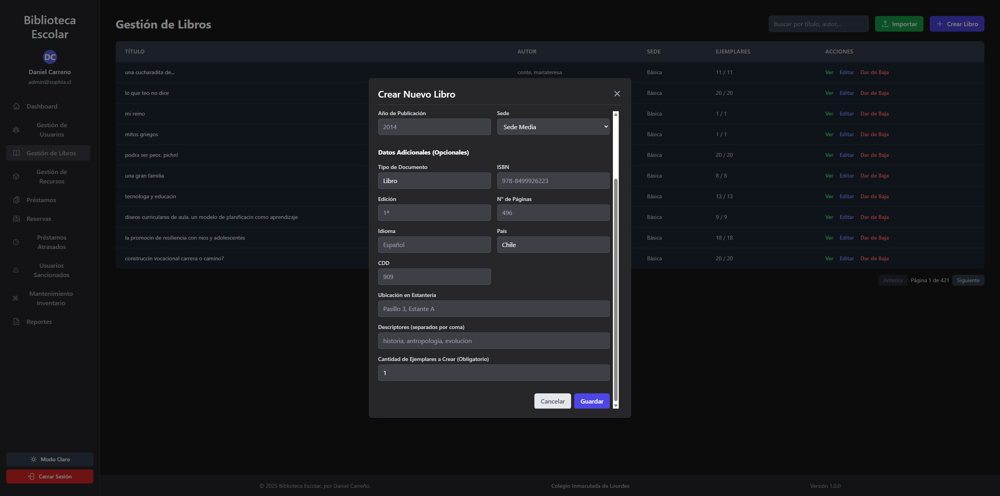  
*Alta de libro (campos obligatorios marcados).*

**Ver / Editar / Borrar libro**

- **Ver:** pulsa **Ver** (modal **BookDetails**).  
- **Editar:** pulsa **Editar** → ajusta datos → **Guardar**.  
- **Eliminar (título + todas las copias):** pulsa **Eliminar** → confirma **Sí, eliminar**.

**Gestionar ejemplares (dentro de Editar)**

- **Agregar copias:** ingresa número en **Ejemplares a agregar** → **Guardar**.  
- **Eliminar copias:** en la lista, **Marcar para eliminar** copias específicas → **Guardar**.  
  - No se permite eliminar copias en estado `prestado` o `reservado`.

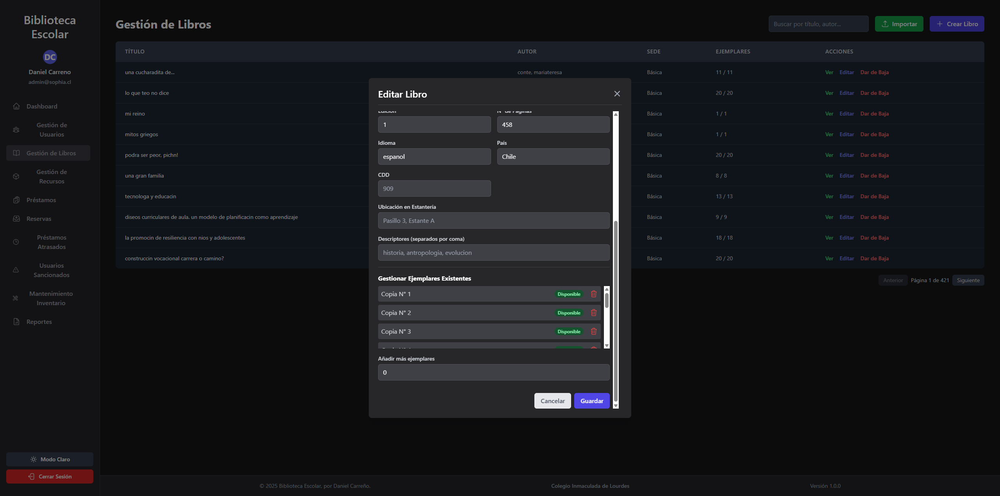  
*Agregar copias y marcar para eliminar (si no están prestadas/reservadas).*

**Estados de ejemplar:** `disponible`, `reservado`, `prestado`, `deteriorado`, `extraviado`.

---

### 1.4 Recursos CRA e Instancias

**Ruta:** *Admin → Recursos CRA*  
**Para:** crear/editar **Recurso** (base) y administrar **Instancias**.

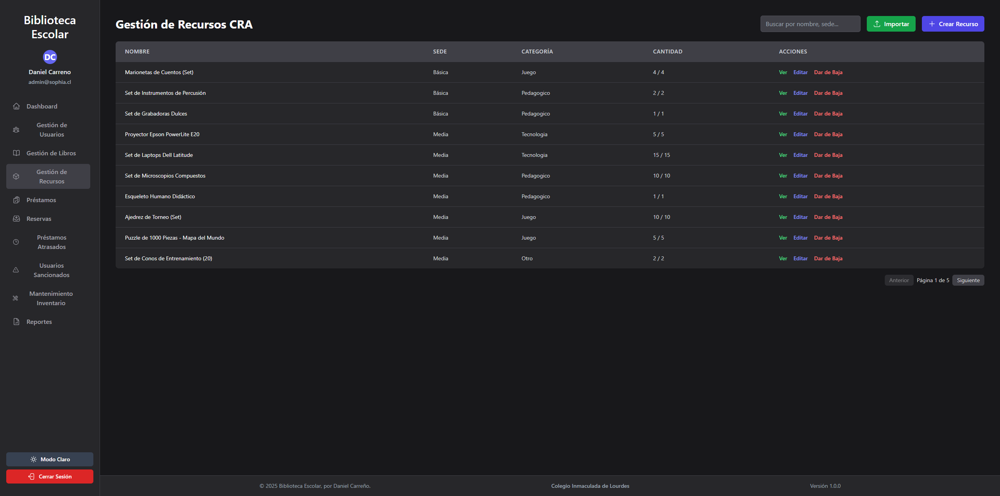  
*Catálogo de recursos no bibliográficos.*

**Crear recurso**

1. Pulsa **Crear Recurso** (modal **ResourceForm**).  
2. Completa campos:
   - **Obligatorios:** `nombre`, `categoria` (`tecnologia`/`juego`/`pedagogico`/`otro`), `sede` (`Media`/`Básica`).  
   - **Opcionales:** `descripcion`, `ubicacion`.  
   - **Instancias iniciales:** `cantidadInstancias` (si lo dejas vacío, **1**).
3. Pulsa **Guardar** (se generan códigos internos, p. ej. `RBB-###` / `RBM-###`, según sede).  
4. **Cancelar** cierra el modal sin cambios.

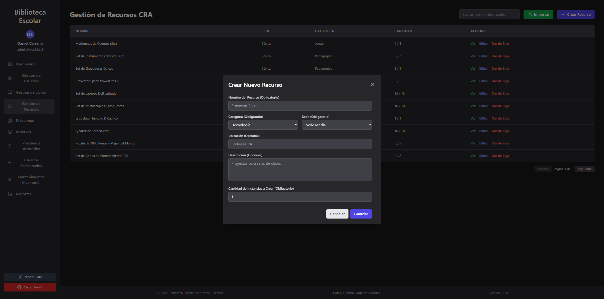  
*Alta de recurso con sede y categoría.*

**Editar / Instancias**

- **Editar:** **Editar** → actualiza → **Guardar**.  
- **Agregar instancias:** **Additional Instances** → cantidad → **Guardar**.  
- **Eliminar instancias:** **Marcar para eliminar** → **Guardar**.  
  - No se permite eliminar si la instancia está `prestado` o `reservado`.

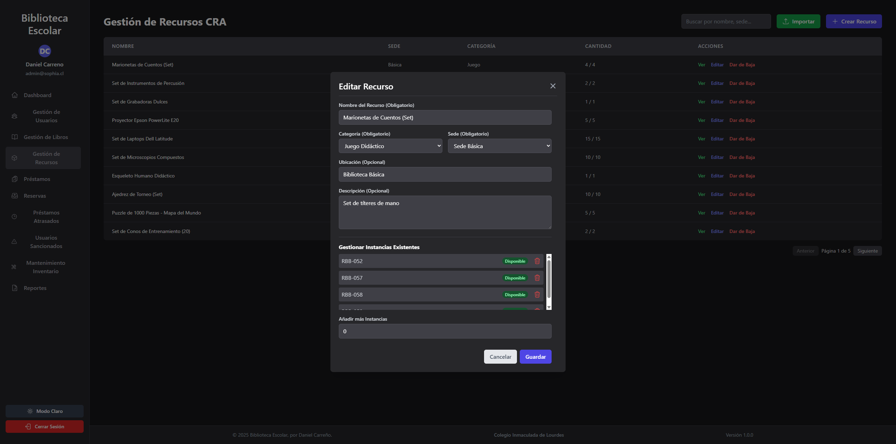  
*Gestión de instancias.*

**Estados de instancia:** `disponible`, `reservado`, `prestado`, `mantenimiento`.

---

### 1.5 Reservas (gestión Admin)

**Ruta:** *Admin → Reservas*  
**Para:** gestionar **reservas pendientes**.

- **Confirmar:** selecciona la reserva → pulsa **Confirmar** → **Sí, confirmar**. La reserva se convierte en **préstamo** y la copia pasa a `prestado`.  
- **Cancelar:** pulsa **Cancelar** → **Sí, cancelar**. La copia vuelve a `disponible`.  
- **Expiración automática:** si pasan **2 días hábiles** sin confirmar, expira sola.

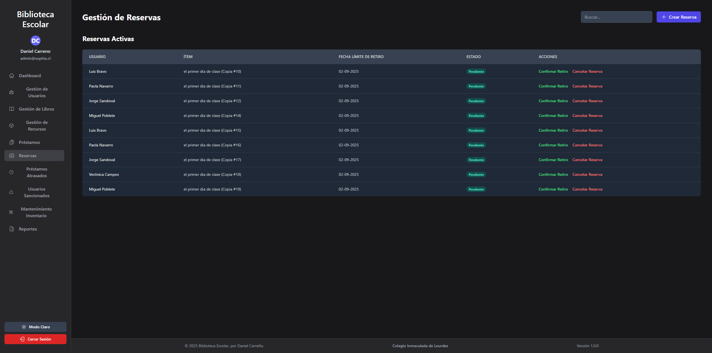  
*Confirmación convierte en préstamo; cancelación libera la copia.*

---

### 1.6 Préstamos

**Ruta:** *Admin → Préstamos*  
**Para:** crear, **renovar** y **devolver**.

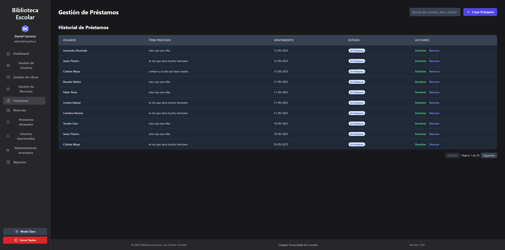  
*Gestión diaria de préstamos.*

**Nuevo Préstamo** (modal **CreateLoanForm**)

1. Pulsa **Nuevo Préstamo**.  
2. Busca **Usuario** (por nombre o RUT) → **Seleccionar**.  
3. Busca **Ítem** (por título/autor o nombre del recurso) → **Seleccionar**.  
4. Revisa que el sistema no muestre advertencias por **cupo**, **sanción** o **duplicado de base**.  
5. Pulsa **Confirmar Préstamo** (o **Cancelar** para cerrar sin cambios).

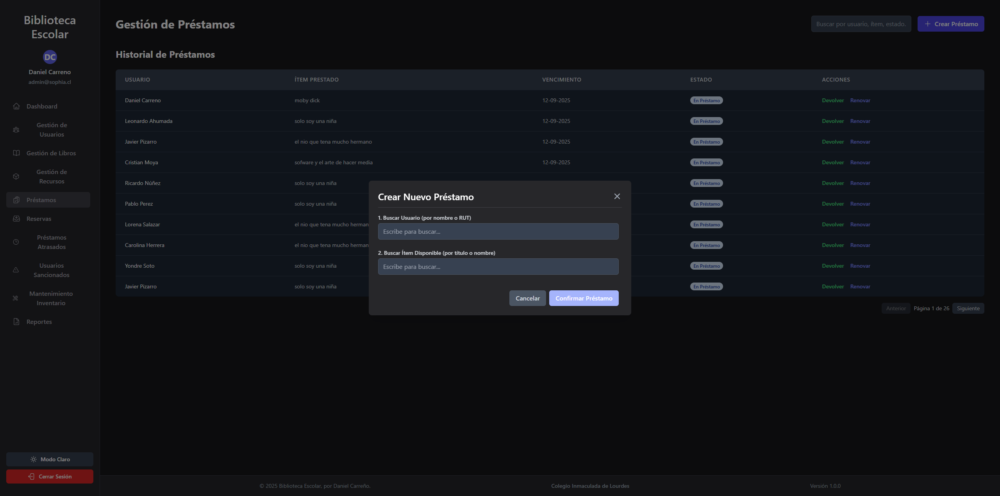  
*Selección de usuario e ítem con validaciones.*

**Renovar** (modal **RenewLoanForm**)

1. En la fila del préstamo pulsa **Renovar**.  
2. Ingresa **días hábiles** a extender.  
3. Pulsa **Renovar** (o **Cancelar**).

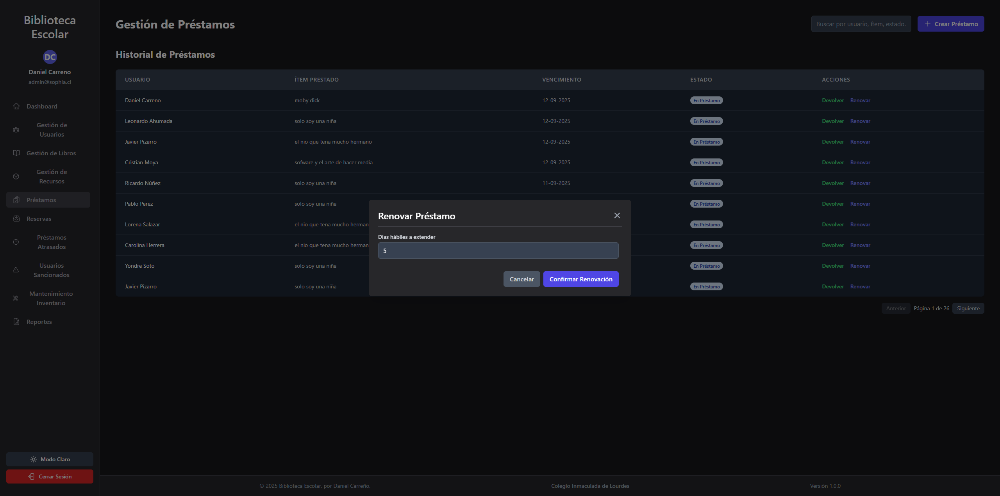  
*Extensión de vencimiento si no hay conflicto.*

**Devolver** (modal **ReturnLoanForm**)

1. En la fila del préstamo pulsa **Devolver**.  
2. Elige **estado final** (`disponible`, `deteriorado`, `extraviado`).  
3. (Opcional) Escribe **observaciones**.  
4. Pulsa **Registrar devolución** (o **Cancelar**).

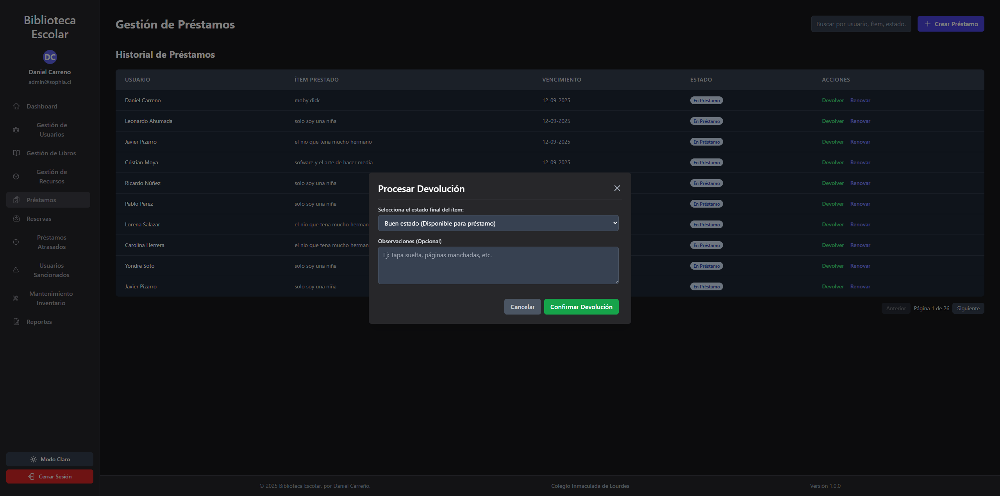  
*Devolución y cambio de estado del ítem.*

**Préstamos Atrasados**

**Ruta:** *Admin → Préstamos Atrasados*  
Lista solo vencidos y muestra **días de atraso**. Permite priorizar y actuar (renovar/devolver) en cada fila.

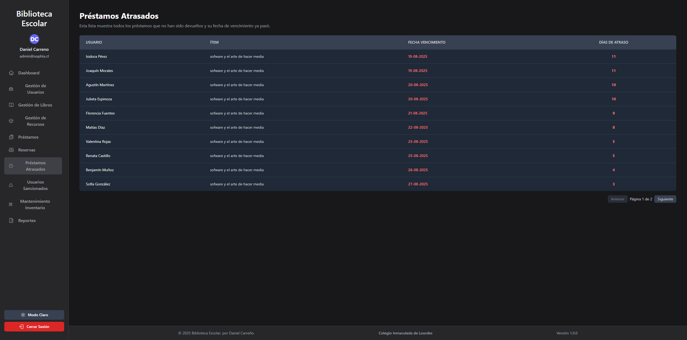  
*Priorización por vencimiento.*

---

### 1.7 Inventario → Atención

**Ruta:** *Admin → Inventario → Atención*  
**Para:** tratar ítems en `deteriorado`, `extraviado`, `mantenimiento`.

- **Reintegrar:** pulsa **Reintegrar** (la copia vuelve a `disponible`).  
- **Dar de baja:** pulsa **Dar de baja** → **Sí, dar de baja**.  
  - Si es la **última copia**, se habilita retirar el **título base**.

  
*Reintegrar o dar de baja copias.*

---

### 1.8 Importación por Excel (común a Usuarios, Libros, Recursos)

**Botón:** **Importar** (abre `ImportComponent`) en cada módulo.

**Flujo de importación (siempre igual)**

1. Pulsa **Descargar plantilla** → guarda `plantilla_usuarios.xlsx` / `plantilla_libros.xlsx` / `plantilla_recursos.xlsx`.  
2. Rellena **sin cambiar los encabezados**.  
3. Pulsa **Seleccionar archivo** → elige `.xlsx`/`.xls` (máx. **20MB**).  
4. Pulsa **Subir**.  
5. Revisa la **tarjeta de resultados**: cantidad **creada/omitida** y **errores por fila** (si existen).  
6. Cierra con **Listo** o **Cerrar** (según tu UI).

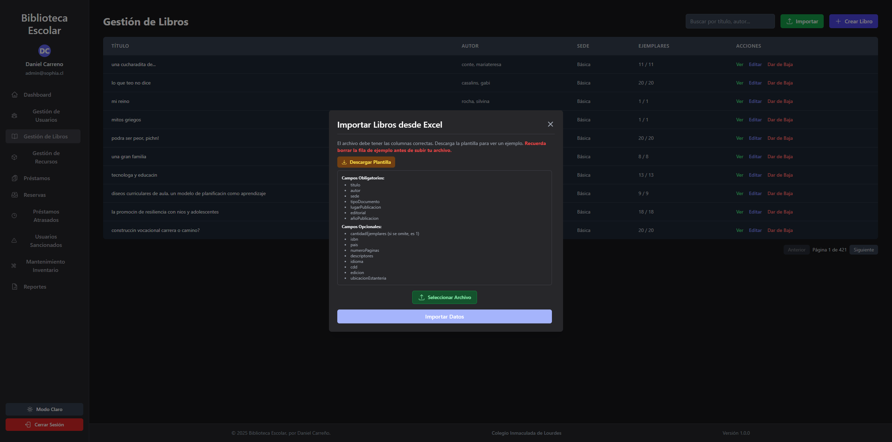  
*Descarga de plantilla y selección de archivo.*

**Reglas por plantilla (resumen)**

- **Usuarios:** oblig. `primerNombre`, `primerApellido`, `rut`, `correo`, `rol` (y `curso` si `rol=alumno`). `password` opcional (si falta, se usa **RUT**). **Unicidad** en `rut` y `correo`.  
- **Libros:** oblig. `titulo`, `autor`, `sede`. Recomendados: `lugarPublicacion`, `editorial`, `añoPublicacion`, `tipoDocumento`=“Libro”. `cantidadEjemplares` (default **1**). **Deduplica** dentro del archivo por `(titulo|autor)` y **suma** ejemplares antes de insertar.  
- **Recursos:** oblig. `nombre`, `categoria`, `sede`. `cantidadInstancias` (default **1**). Si `nombre` ya existe en BD, esa fila se reporta como **error**.

---

## 2) Rol: Alumno

**Pantallas:** *Catálogo*, *Mis Reservas*, *Mis Préstamos*.

**Reservar desde el Catálogo**

1. Busca el título.  
2. Si hay disponibilidad, pulsa **Reservar** → confirma en el modal con **Sí, reservar**.  
3. Verás la reserva en **Mis Reservas** con fecha de **expiración (2 días hábiles)**.

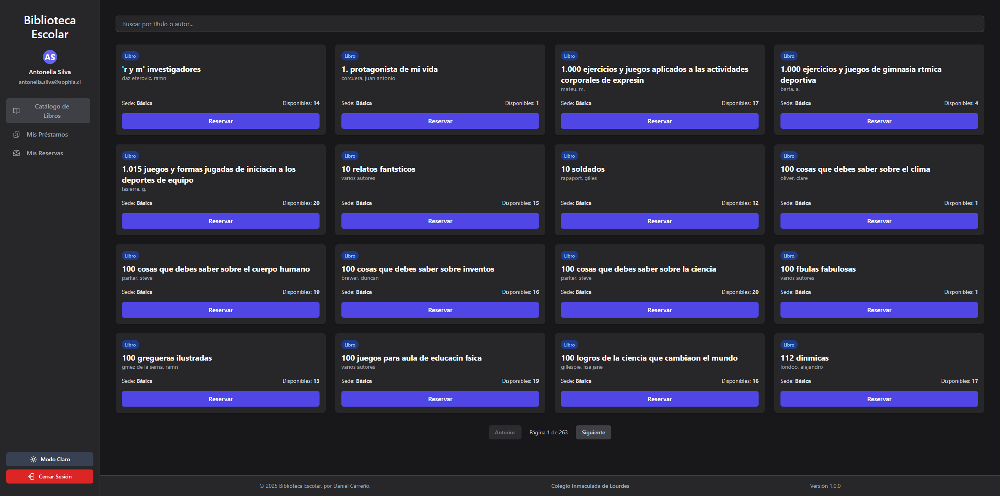  
*Reserva disponible cuando hay ejemplares.*

**Cancelar reserva**  
- En **Mis Reservas**, pulsa **Cancelar** → **Sí, cancelar**.

**Ver préstamos**  
- En **Mis Préstamos** revisa tu **vencimiento**.

**Solicitar renovación**  
- Contacta al **Admin** antes del vencimiento (él pulsa **Renovar** en su pantalla).

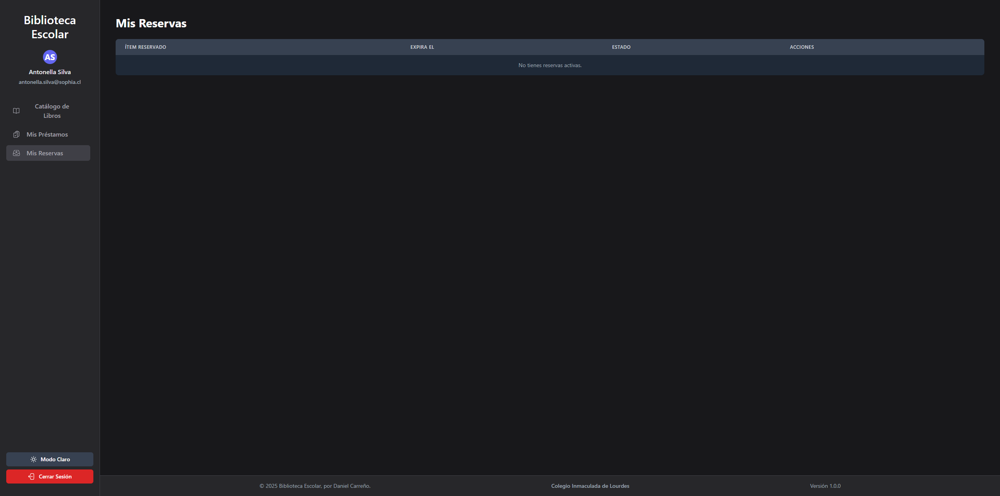  
*Cancelar libera la copia si aún no se confirma.*

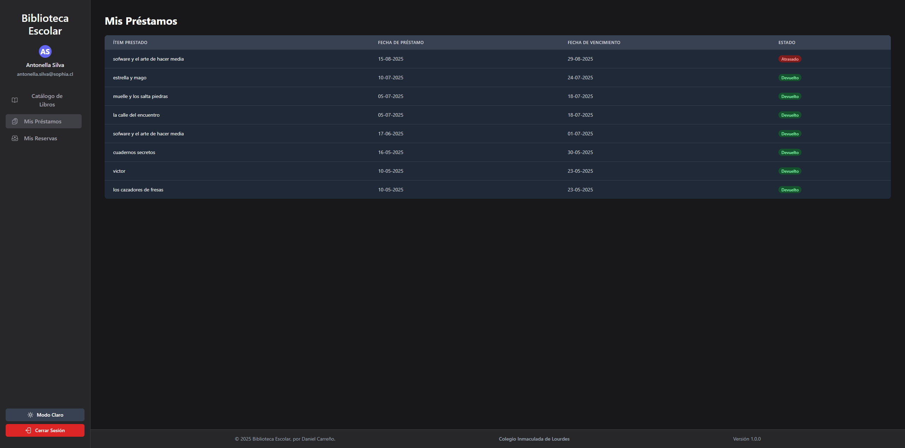  
*Consulta de vencimientos y estado de préstamos.*

> **Límites que te aplican (por defecto):** máx. **1** préstamo activo (**libros**). No puedes tener **dos copias del mismo libro** entre reserva y préstamo.

---

## 3) Rol: Personal / Docente

**Pantallas:** *Catálogo*, *Mis Reservas*, *Mis Préstamos* (como alumno) **+** acceso a **recursos CRA**.

- **Reservar libros y recursos** cuando estén `disponible` (**Reservar** → **Sí, reservar**).  
- **Vencimientos de recursos:** normalmente **mismo día** (según política).  
- **Renovación:** solicita al **Admin** antes del vencimiento.  
- **Cupos:** suelen ser **mayores** que los del alumno (definidos por el colegio).  
- **No duplicar base:** no puedes tener dos copias del **mismo libro/recurso** simultáneamente (reserva+préstamo).

  
*Acceso a recursos CRA además de libros.*

---

## 4) Rol: Visitante

- **Catálogo público:** puedes **buscar** y **ver detalles**, sin botones de acción.  
- Para **reservar** o ver paneles personales, **inicia sesión**.

  
*Consulta sin iniciar sesión (solo lectura).*

---

## 5) Reglas y validaciones (resumen operativo)

- **Reserva:** expira a **2 días hábiles** si no se confirma (Admin → **Confirmar**).  
- **Préstamo:** fecha de **vencimiento** (Libro: **10 días hábiles**; Recurso: **del día**).  
- **Renovación:** la ejecuta el **Admin** (si no hay atraso ni reservas en conflicto).  
- **Devolución:** Admin pulsa **Devolver** y registra **estado final**.  
- **Sanción:** por atraso; no permite nuevas reservas/préstamos; se **perdona** en *Admin → Usuarios Sancionados* (**Perdonar sanción**).  
- **No duplicar base:** nadie puede tener dos copias del **mismo título/recurso** entre reservas y préstamos.  
- **Eliminación segura:**
  - Usuarios con **préstamos activos/atrasados** no se eliminan.  
  - Copias `prestado`/`reservado` no se eliminan.  
  - **Última copia** dada de baja permite retirar el **base** (libro/recurso) del catálogo.

---

## 6) Errores comunes y solución

- **Acceso denegado / 401** → vuelve a **Iniciar sesión**.  
- **No tienes permisos** → tu **rol** no habilita esa acción.  
- **Límite alcanzado / sancionado** → devuelve/regulariza o espera fin de la sanción.  
- **Importación fallida** → revisa **encabezados** de plantilla, **duplicados** (RUT/Correo/ISBN/Nombre recurso), **mimetype** y **tamaño ≤ 20MB**.

---

- **Todos:** si ocurre un problema, anota **pantalla**, **acción** y **hora** y avisa a la biblioteca.
